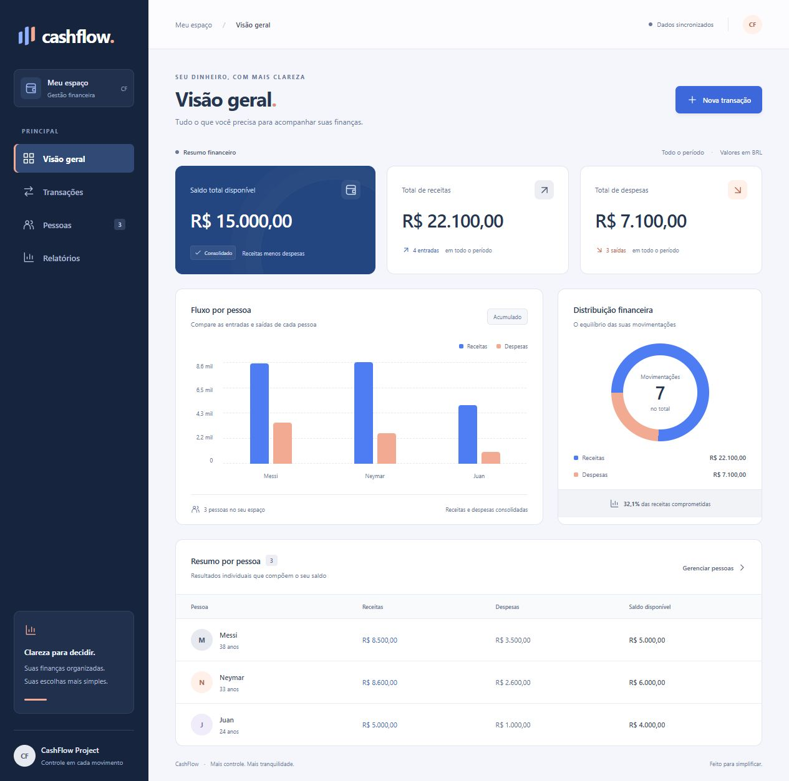

# CashFlow

**Mais controle. Mais tranquilidade.**

Dashboard de gestão financeira com React, TypeScript e uma API REST em .NET. Organize pessoas, registre receitas e despesas e acompanhe os resultados em uma interface responsiva.


## Preview



## Funcionalidades

- **Visão geral:** saldo disponível, total de receitas e despesas e quantidade de movimentações.
- **Gráficos:** comparação de receitas e despesas por pessoa e distribuição das movimentações financeiras.
- **Transações:** histórico com busca por descrição ou pessoa e filtros de receita e despesa.
- **Pessoas:** cadastro, busca, resumo individual e exclusão com confirmação.
- **Relatórios:** resultados consolidados e exportação por pessoa em CSV compatível com planilhas.
- **Interface responsiva:** navegação adaptada para desktop, tablet e celular, formulários em modais e mensagens de sucesso e erro.
- **Identidade visual:** azul profundo e coral, com menu lateral escuro e cores consistentes nos gráficos e formulários.

Os indicadores usam os dados da API. Os gráficos representam todo o período disponível; o modelo atual não registra a data das transações. O gráfico por pessoa mostra até seis pessoas, ordenadas pelo total movimentado, e a tabela inclui todas.

## Tecnologias

| Camada | Tecnologias |
| --- | --- |
| Frontend | React 19, TypeScript 6, Vite 8, CSS e Axios |
| Backend | ASP.NET Core 10 e Entity Framework Core 10 |
| Persistência | SQLite e migrations do EF Core |
| Verificação | TypeScript, build do Vite e Oxlint |

## Como executar

### Pré-requisitos

- .NET SDK 10.
- Node.js compatível com Vite 8 (22.12+ na linha 22 ou uma versão posterior compatível) e npm.

### 1. Inicie a API

```bash
cd CashFlowAPI
dotnet restore
dotnet run --launch-profile http
```

API: [http://localhost:5007](http://localhost:5007).

O repositório inclui um banco SQLite. Para recriá-lo ou aplicar migrations, com a ferramenta `dotnet-ef` 10 instalada, execute `dotnet ef database update` dentro de `CashFlowAPI`.

### 2. Inicie o frontend

Em outro terminal:

```bash
cd cashflow-frontend
npm ci
npm run dev
```

Abra [http://localhost:5173](http://localhost:5173). A política CORS da API permite essa origem.

O frontend usa `http://localhost:5007/api` por padrão. Para outra URL, defina `VITE_API_URL` em um arquivo `.env.local` no diretório do frontend. Se alterar a origem do frontend, ajuste também o CORS em `CashFlowAPI/Program.cs`.

### Verificação do frontend

```bash
npm run build
npm run lint
```

## Regras de negócio

1. Pessoas menores de 18 anos só podem registrar despesas. O formulário orienta o usuário e a API valida a regra.
2. Toda transação precisa estar vinculada a uma pessoa existente.
3. Os tipos aceitos pela API são `Receita` e `Despesa`.
4. Excluir uma pessoa também exclui suas transações. A interface pede confirmação antes da remoção.
5. O saldo individual e o saldo geral correspondem às receitas menos as despesas.

## Endpoints

| Método | Endpoint | Descrição |
| --- | --- | --- |
| GET | `/api/pessoas` | Lista pessoas |
| POST | `/api/pessoas` | Cadastra pessoa |
| DELETE | `/api/pessoas/{id}` | Remove pessoa e transações vinculadas |
| GET | `/api/transacoes` | Lista transações |
| POST | `/api/transacoes` | Registra transação |
| GET | `/api/relatorios` | Retorna totais por pessoa e saldo geral |

## Estrutura

```text
CashFlowAPI/
├── Controllers/        # Pessoas, transações e relatórios
├── Models/             # Entidades e contexto do banco
├── Migrations/         # Evolução do banco de dados
└── Program.cs          # Serviços, rotas e CORS
cashflow-frontend/
├── src/
│   ├── App.tsx         # Dashboard e integração com a API
│   ├── App.css         # Componentes e layout responsivo
│   ├── index.css       # Estilos globais
│   └── main.tsx        # Entrada da aplicação
└── public/             # Favicon e arquivos públicos
IMG/
└── dashboard.png       # Captura da interface
```

## Sobre

Projeto desenvolvido como exercício técnico de gestão de fluxo de caixa.
